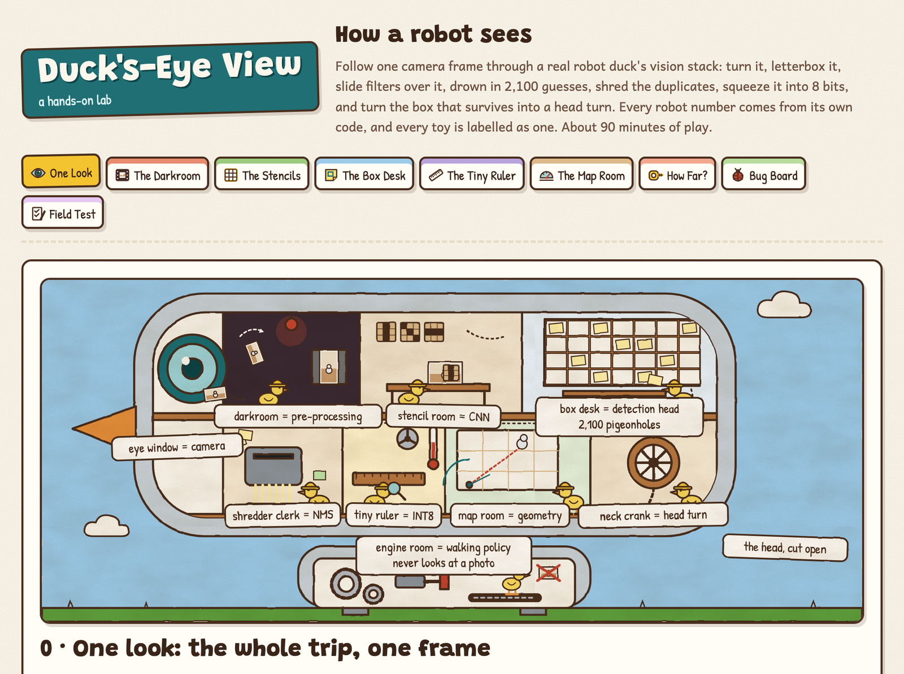
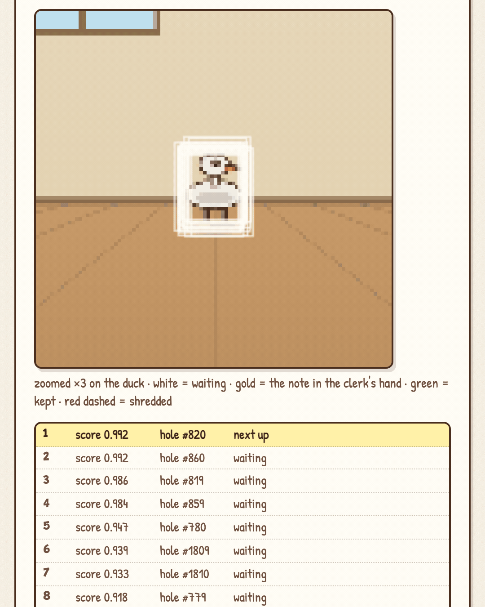

# Duck's-Eye View

**A hands-on lab for how a robot sees.** Follow one camera frame through a real robot duck's vision stack: turn it, letterbox it, slide filters over it, drown in 2,100 guesses, shred the duplicates, squeeze it into 8 bits, and turn the one box that survives into a head turn.

**Play it: https://bakulbadwal.github.io/ducks-eye-view/**





*Step 3, the shredder: 20 candidates pass the gate, greedy NMS keeps one.*

The robot is **Microduck**, a 25 cm open-source robot duck ([pollen-robotics/microduck](https://github.com/pollen-robotics/microduck)). Its head camera feeds a tiny YOLO detector on an 8-bit NPU that finds *other* Microducks and turns the head toward them.

Here the head is drawn as a workshop staffed by ducklings in hard hats:
- **the eye window** is the camera;
- **the darkroom** is pre-processing;
- **the stencil room** is the CNN;
- **the box desk** with its 2,100 pigeonholes is the detection head;
- **the shredder clerk** is non-maximum suppression;
- **the tiny ruler** is INT8;
- **the map room** is the camera's geometry;
- **the neck crank** turns the head.

The engine room downstairs runs the walking policy, and it never looks at a photo. That's [Policy Pond](https://github.com/bakulbadwal/policy-pond)'s world.

## What's inside

| Step | You play with | What clicks |
|---|---|---|
| **0 · One Look** | Move a duck, press one button, and watch one frame go camera → turn → letterbox → 2,100 candidates → NMS → bearing → head turn, with every station's live numbers; a one-second time budget against the 50 Hz walking loop | Vision is a slow, behaviour-level sense. Most of a "look" used to be pre-processing |
| **1 · The Darkroom** | Probe pixels, turn the frame upright, letterbox vs stretch, drag the pad grey away from 114, swap RGB for BGR, nearest vs bilinear, map boxes back out of the letterbox | A pre-processing mismatch doesn't crash; the detector gets **quietly worse** |
| **2 · The Stencils** | Paint a 3×3 kernel and run it on the camera frame; stride and padding by hand; stack stride-2 layers until 320 px becomes 40, 20 and 10 cells; standard vs depthwise-separable cost | Why YOLO has three grids, and 40² + 20² + 10² = **2,100** candidate boxes |
| **3 · The Box Desk** | Read any pigeonhole's sticky note straight from the real `[1, 5, 2100]` layout; step through NMS one IoU at a time; drag boxes to hit an IoU; a precision–recall report card on a held-out session; read the tensor wrong on purpose | "One duck comes back as twenty overlapping boxes" is normal. mAP50 is area under a curve |
| **4 · The Tiny Ruler** | A 256-notch ruler with scale and zero point; the real model files (10.5 MB float vs 3.9 MB INT8); quantize the head's output with one shared scale; looks per second against board temperature | Why every real detection reads **"about 1.3"**, and why 2 looks per second "is a thermal limit, not a preference" |
| **5 · The Map Room** | Drag the duck around a top-down room and watch the pinhole put it in the frame; the sensor-mode puzzle; a naive "62° across the width" guess vs the calibrated intrinsics | A sideways 16:9 mount can't see wider than **37°** left to right, however the spec sheet reads. Taking 62° at face value over-turns the head by ~7° |
| **6 · How Far?** | A small near duck vs a big far duck; a stereo rig with its Z² error; the 8×8 time-of-flight grid with floor filtering; fuse camera, ToF and BLE to find the right duck | One camera gives direction, not distance. Camera = direction, ToF = distance, BLE = identity |
| **★ Bug Board** | Three real bugs from the robot's own code comments: "quietly worse", "the threshold does nothing", "the head over-turns". Fix each, re-run the pipeline, and name the cause | You can debug a deployed detector, and the tempting wrong fixes fail for the stated reason |
| **✓ Field Test** | Eight questions answered by operating the widgets | Proof it stuck |

Each step has predict-then-reveal questions and a "say it out loud" line that unlocks once you've played. Every term has a tooltip with its plain meaning and its head-workshop equivalent. Progress is saved in your browser.

![The box desk: every pigeonhole's score on the 40×40 grid, one sticky note read straight out of the raw [5, 2100] tensor by index, and twenty notes shredded down to one](docs/boxdesk.png)

## Why another computer-vision demo

The good interactive CV explainers each cover one idea:
- [CNN Explainer](https://poloclub.github.io/cnn-explainer/) walks through convolution inside a small classifier;
- Setosa's [Image Kernels](https://setosa.io/ev/image-kernels/) lets you paint a filter;
- Kyle Simek's [camera-matrix series](https://ksimek.github.io/2013/08/13/intrinsic/) makes intrinsics interactive;
- Distill's [Feature Visualization](https://distill.pub/2017/feature-visualization/) shows what deep layers learn.

None follows one frame through a **deployed** robot's pipeline. Duck's-Eye View covers the part they don't:

1. **The deployment failures, made tangible.** Each one is in Microduck's real code comments:
   - a pre-processing mismatch that makes a detector "quietly worse";
   - NMS on the real output layout;
   - an INT8 export whose shared scale turns confidence into an on/off switch;
   - a sideways camera mount that shrinks the field of view.
2. **Real code, ported.** The letterbox, the planar decode and the greedy NMS are line-for-line ports of `duck-detect/src/lib.rs`, and every robot fact on the page links to its source line at a pinned commit.
3. **One frame, end to end.** The same synthetic room runs through every step, and its pixels obey the pinhole model the geometry step teaches. The duck you drag in step 5 is drawn exactly where step 5's math says it should be.

For convolution on its own, CNN Explainer is better than anything here. Read it after step 2.

## Run it

Play it live at the link above, or open `index.html` in a browser. There's no build step, no dependencies, and nothing to install.

Check the math yourself (Node, no dependencies):

```bash
node tests/core.test.js
```

## What's exact and what's a teaching model

- **Exact:**
  - the letterbox, decode and greedy NMS, ported from `duck-detect`;
  - IoU, precision/recall, all-point and 101-point AP;
  - affine INT8 quantisation (scale, zero point, per-tensor vs per-channel);
  - convolution, output sizes, receptive fields and the YOLO grid count;
  - the pinhole camera, sensor-mode fields of view, and bearing → angle;
  - stereo depth and its error;
  - the ToF beam geometry;
  - Microduck's facts, pinned to [`590b986`](https://github.com/pollen-robotics/microduck/tree/590b986).
- **Teaching models, labelled on the page:**
  - the synthetic room;
  - the detector's scores: a stand-in that fills the real `[1, 5, 2100]` layout, not yolo11n. Its 0.979 AP50 on the toy session is a toy number beside the real model's 0.976 (its first run; a later public run tested on a harder held-out session scored 0.80);
  - the thermal curve (only "95 °C and 408 MHz flat out" comes from the repo);
  - a camera height of 0.20 m;
  - the BLE signal-strength hint.
- **The directions are real; the numbers are a toy's.** One piece is our inference: the 37.35° field of view assumes the full-width 16:9 sensor mode, and the page says so.

`tests/core.test.js` checks the math and [`ACCEPTANCE.md`](ACCEPTANCE.md) lists every number the build was verified against.

## Sources

- [Hugging Face Community Computer Vision Course](https://huggingface.co/learn/computer-vision-course), Units 1, 2, 3, 4, 6, 8, 9: the spine
- [pollen-robotics/microduck](https://github.com/pollen-robotics/microduck) (Apache-2.0):
  - `duck-detect/src/lib.rs`
  - `deploy/robotd.toml`
  - `docs/project/npu-bringup.md`
  - `docs/ideas/autonomous_behavior.md`
  - `kinematics/src/tof.rs`
  - `mediad/src/session.rs`
- [Ultralytics YOLO11](https://docs.ultralytics.com/models/yolo11/): the detector family
- The author's study pack for the course, whose worked numbers every step reproduces

## Files

| File | Role |
|---|---|
| `index.html` | All teaching copy and page structure |
| `js/core.js` | The math: pure functions, exposed as `window.DEV.core` (also a Node module) |
| `js/framework.js` | Navigation, progress, predictions, tooltips, and the synthetic camera renderer |
| `js/steps/s0–s6.js`, `cap.js`, `ft.js` | One file per step: its widgets and step-specific helpers |
| `js/art/s0–s6.js`, `cap.js` | The hand-built SVG cutaway scenes |
| `js/microduck.js` | Every robot fact, with its source line |
| `js/glossary.js` | Tooltip definitions (steps add their own) |
| `tests/core.test.js` | Deterministic checks on the math |
| `PRODUCT.md`, `DESIGN.md` | Product brief and the recorded design system |

Built by [Bakul Badwal](https://github.com/bakulbadwal) (UVA Darden MBA '27) with Claude Code, as an interactive companion to his study of the Hugging Face Computer Vision Course. It's the third lab in a series, after [Inference Kitchen](https://github.com/bakulbadwal/inference-kitchen) and [Policy Pond](https://github.com/bakulbadwal/policy-pond). Not affiliated with Pollen Robotics or Hugging Face.

## License

MIT
